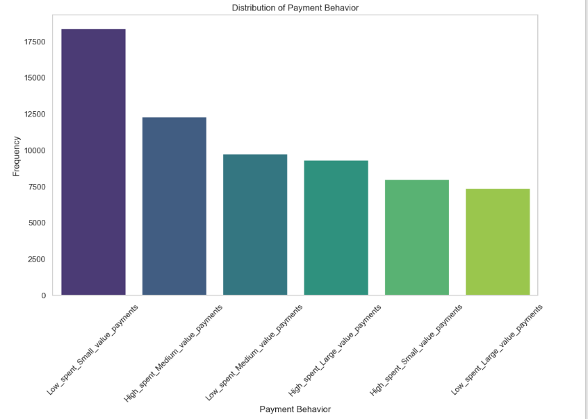
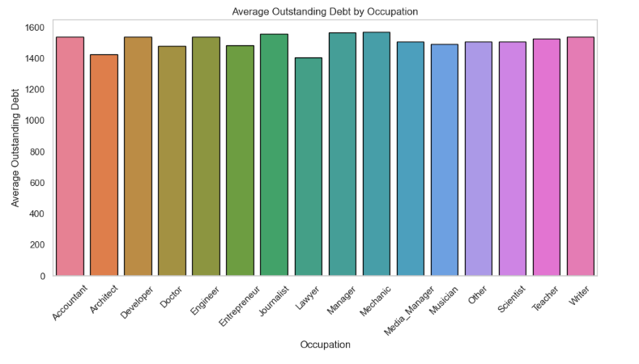

# REVOLUTIONAZING CUSTOMERS CREDIT SCORE

This project is a machine learning application designed to assess customer creditworthiness by predicting credit scores.

# Business Problem
NicoElNino Microfinance is experiencing difficulties in accurately assessing the creditworthiness of its customers, resulting in increased loan defaults and financial losses. The company’s current methods of evaluating credit risk are manual and inefficient, undermining customer trust and business growth. To address this challenge, NicoElNino Microfinance, in collaboration with Providentia, aims to develop an intelligent credit scorecard system. 

This system will leverage the company’s extensive financial and credit-related data, along with demographic information, to automatically segregate customers into credit score brackets. By improving the accuracy of credit risk assessments, the goal is to enhance lending decisions, reduce default rates, and restore customer confidence.

### Objectives

#### Reduce Loan Defaults:
Minimize financial losses by improving the accuracy of credit risk assessments and reducing the likelihood of granting loans to high-risk customers.
#### Enhance Lending Decisions:
Empower the organization to make more informed, data-driven decisions when approving loans, ensuring fair access to credit for eligible customers.
#### Improve Operational Efficiency:
 Automate the credit evaluation process to reduce manual effort, speeding up loan processing and improving customer experience.

 # Technical Approach
- Data Cleaning and Preprocessing: Missing values were handled, and data was standardized for the model.
- Feature Engineering: Several new features were created based on existing data to improve model performance.
- Model Training and Tuning: The models were trained and fine-tuned for optimal accuracy.
- Evaluation: The model was evaluated on test data using metrics such as accuracy, precision, recall, and F1-score.

# EDA

# Models
1.Logistic regression

2.Random Forest

3.XGBoost

 The performance of the models are as shown below;
 
   | No | Model | AUC Score |
   |-|-|-|
   | 01 | Logistic Model | 82% |
   | 02 | XGBoost  | 93% |
   | 03 | Random Forest  | 94% |

# Findings
- The most frequent payment behavior is "Low_spent_Small_value_payments," suggesting that a large proportion of customers prefer conservative spending with smaller payments. This may indicate a cautious or budget-conscious segment of the customer base. These individuals might prioritize staying within a fixed budget, making them potentially lower-risk in terms of credit management.
 
- Majority of customers have a "Good" credit score, suggesting that the customer base is predominantly lower-risk.
 
- Average outstanding debt remained fairly consistent throughout the months showing no significant spike or drop, which suggests a stable debt level 
